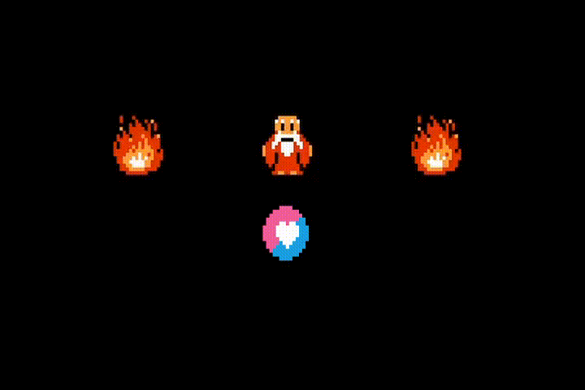

# Mini Zelda

## About
I tried to recreate some mechanics from *"The Legend of Zelda 1986"* using LOVE2D for my CS50 Final Project.

~~I would implement more features but I feel running off time D:~~

### Objective
* Get the last **Triforce Shard** in the dungeon.

### Controls
* Move: ARROW KEYS
* Attack sword: F
* Attack bow: D
* Select: Enter

## How to run the game

 1. Clone this repository.
 2. [Download Love2D](https://love2d.org/)
 3. Drag and drop the **mini_zelda** folder on the LOVE2D desktop icon.
 4. Enjoy :D

## Tecnology used
Coded in Lua using the Love2D Framework.
Maps made in [Tiled](https://www.mapeditor.org/).

## Libraries
* [hump](https://github.com/vrld/hump): Class and Vector.
* [STI](https://github.com/karai17/Simple-Tiled-Implementation)
* [windfield](https://github.com/a327ex/windfield)
* [anim8](https://github.com/kikito/anim8)
* [push](https://github.com/Ulydev/push)

### Credits: Nintendo
